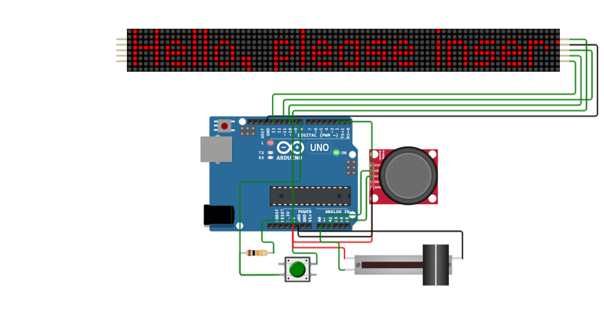

# Scrolling Message Board

This project is a simple interactive message board using an Arduino Uno and a dot matrix display. It lets users enter a message through the Serial Monitor and control how it scrolls on the screen.


## Features

- **User Input:** Type a message (up to 100 characters) through the Serial Monitor.
- **Scroll Direction:** Control the direction with a joystick (Left→Right, Right→Left, Up→Down, Down→Up, Freeze).
- **Speed Control:** Use a slide potentiometer to change the scrolling speed (10 to 80 frame delays).
- **Reset Button:** Shows a welcome message when pressed or when the system starts.

## Hardware Used

- Arduino Uno
- Dot Matrix Display (with MAX7219)
- Push Button (for reset)
- Slide Potentiometer (for speed)
- Analog Joystick (for direction)
- Wires and resistors as needed

## Files in this Project

- `scrolling_message.ino` - Main Arduino code.
- `diagram.j` - The Wokwi circuit diagram.
- `libraries.txt` - List of libraries used (e.g., Parola library).

## Instructions

1. Upload the sketch to your Arduino Uno.
2. Open the Serial Monitor at **57600 baud rate**.
3. Type a message and press Enter.
4. Use the joystick to set scroll direction.
5. Adjust speed with the slider.
6. Press the push button to reset.

```md

